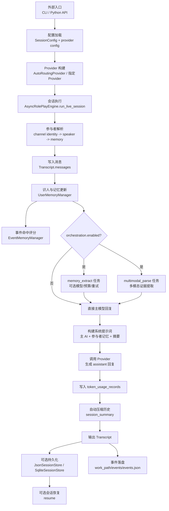

# Sirius Chat 全量架构与流程图

本文档给出项目的完整可读架构视图，覆盖：

- 端到端执行流程
- 关键模块边界
- 每个模块的输入/输出产物
- 代码更新后的文档同步要求

## 1. 全量端到端流程图



## 2. 模块分层图

```mermaid
flowchart LR
    subgraph Entry[入口层]
      CLI[cli.py]
      PublicAPI[api/]
      Main[main.py]
    end

    subgraph Domain[领域与编排层]
      Models[models.py]
      Engine[async_engine.py]
      Prompting[roleplay_prompting.py]
      UserMemory[user_memory.py]
      TokenUsage[token_usage.py]
    end

    subgraph Infra[基础设施层]
      SessionStore[session_store.py]
      SessionRunner[session_runner.py]
      Routing[providers/routing.py]
      ProviderBase[providers/base.py]
      Middleware[providers/middleware/] ✨
      ProviderImpl[providers/*]
    end

    Main --> PublicAPI
    CLI --> PublicAPI
    PublicAPI --> Engine
    PublicAPI --> Prompting
    Engine --> Models
    Engine --> UserMemory
    Engine --> TokenUsage
    Engine --> ProviderBase
    Routing --> ProviderImpl
    CLI --> Routing
    SessionRunner --> Engine
    SessionRunner --> SessionStore
```

## 3. 模块输入/输出产物清单

| 模块 | 主要输入 | 主要输出/产物 |
| --- | --- | --- |
| `main.py` | 命令行参数、用户输入、`work_path` | `Transcript`、`transcript.json`、`session_config.persisted.json`、`primary_user.json` |
| `sirius_chat/cli.py` | JSON 配置、单轮用户输入（`--message` 或一条交互输入） | 单轮 `Transcript`、`transcript.json` |
| `sirius_chat/api/` | 外部程序调用参数 | 稳定对外函数与类型、`Transcript` |
| `sirius_chat/models.py` | 配置与消息数据 | 统一数据契约（`SessionConfig`、`Message`、`Transcript` 等） |
| `sirius_chat/async_engine.py` | `SessionConfig`、`human_turns`、可选已有 `Transcript` | 更新后的 `Transcript`、assistant 回复、编排统计与 token 记录 |
| `sirius_chat/user_memory.py` | speaker/channel identity、用户消息文本 | 用户档案与运行时记忆（profile/runtime）、事件记忆（命中/新增） |
| `sirius_chat/roleplay_prompting.py` | 角色问答、agent 名称、模型 | `GeneratedSessionPreset`、`generated_agents.json`、可直接创建的 `SessionConfig` |
| `sirius_chat/token_usage.py` | `Transcript.token_usage_records` | baseline 与按 actor/task/model 聚合报表 |
| `sirius_chat/session_store.py` | `Transcript` | JSON/SQLite 持久化状态文件 |
| `sirius_chat/session_runner.py` | `SessionConfig`、Provider、主用户输入 | 自动持久化会话循环、主用户档案维护 |
| `sirius_chat/providers/base.py` | `GenerationRequest` | Provider 协议（同步/异步生成契约） |
| `sirius_chat/providers/middleware/` ✨ | `GenerationRequest`、中间件链配置 | 透明的 Provider 功能扩展（流控、重试、成本计量） |
| `sirius_chat/providers/routing.py` | provider 配置、模型名 | 目标 Provider 选择结果、`provider_keys.json` |
| `sirius_chat/providers/openai_compatible.py` | `GenerationRequest` | 模型文本回复 |
| `sirius_chat/providers/siliconflow.py` | `GenerationRequest` | 模型文本回复 |
| `sirius_chat/providers/volcengine_ark.py` | `GenerationRequest` | 模型文本回复 |
| `sirius_chat/providers/mock.py` | `GenerationRequest` | 可预测测试回复 |

## 4. 关键运行产物说明

- `Transcript.messages`: 会话全量消息（system/user/assistant）。
- `Transcript.user_memory`: 识人记忆状态（跨轮次延续）。
- `Transcript.session_summary`: 自动压缩后的历史摘要。
- `Transcript.orchestration_stats`: 任务级统计（attempted/succeeded/failed 等）。
- `Transcript.token_usage_records`: 每次模型调用的 token 归档。
- `generated_agents.json`: 由提示词生成器输出并持久化的 agent 资产库。
- `session_state.json` / `session_state.db`: 会话持久化与恢复状态。
- `events/events.json`: 事件记忆持久化文件（用于跨会话事件命中）。

## 5. 代码更新后的强制同步规则

当仓库发生代码更新时，本文件必须同步检查并更新以下内容：

1. 流程图是否仍与当前执行路径一致。
2. 模块输入/输出是否与代码契约一致。
3. 新增模块是否出现在分层图和产物清单中。
4. 删除/合并模块是否从图与表中移除。

推荐同步顺序：

1. 更新代码。
2. 更新 `docs/full-architecture-flow.md`。
3. 再同步 `docs/architecture.md`、README 与 SKILL（如有必要）。
4. 运行 `pytest -q` 验证。

