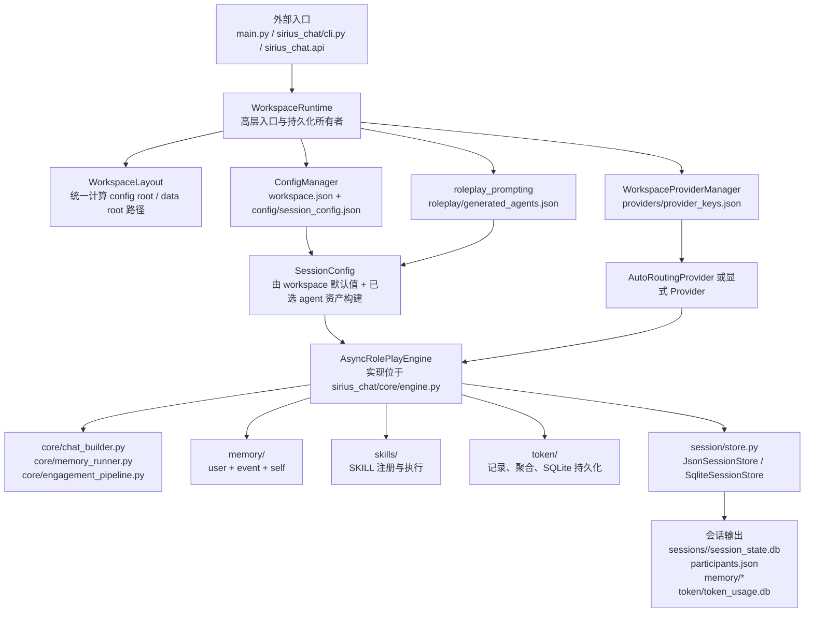
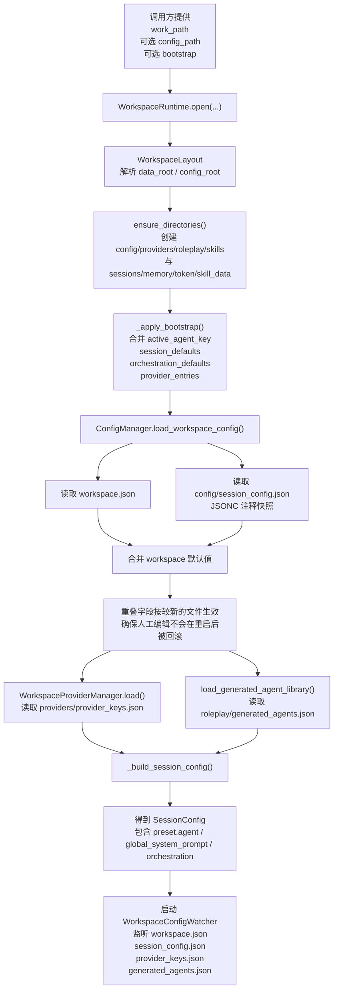
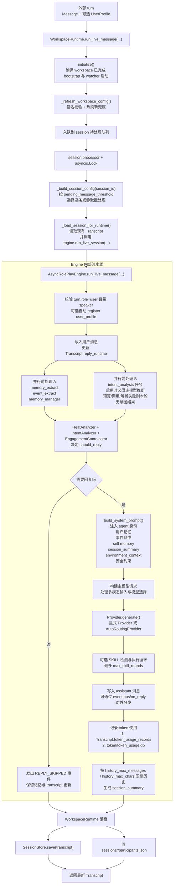
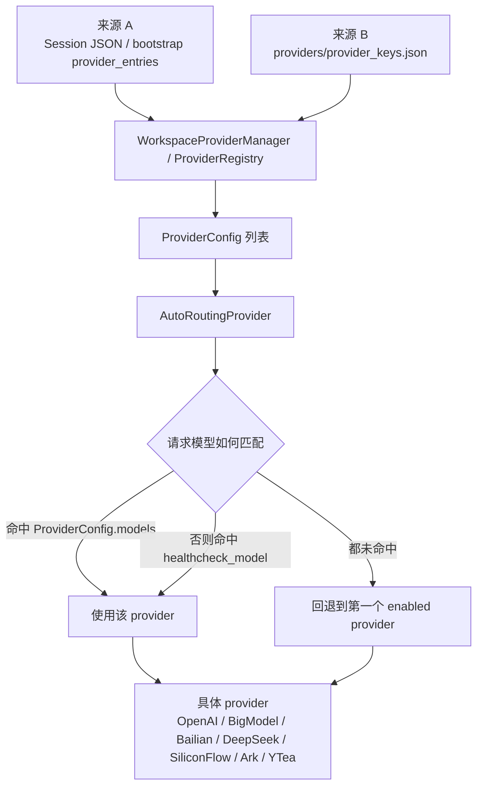
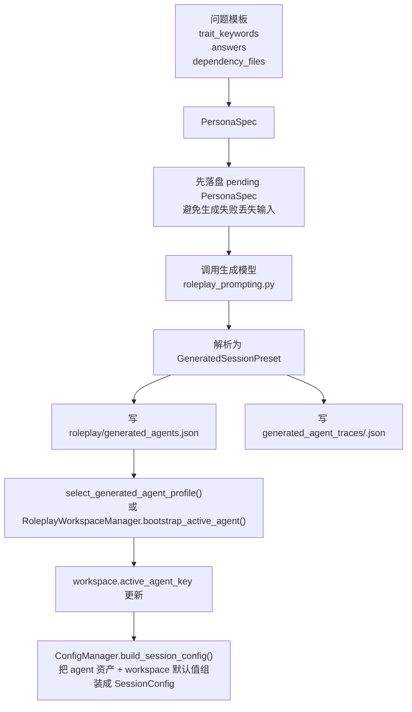

# Sirius Chat 全量架构与流程图

本文档描述当前代码的真实执行路径与模块边界，重点覆盖：

- 入口层如何进入 workspace 与 session
- `WorkspaceRuntime`、`ConfigManager`、`WorkspaceLayout` 的协作关系
- `AsyncRolePlayEngine` 的单轮执行流水线
- provider 路由、roleplay 资产、session store 与 memory 的落盘位置

历史迁移文档只用于说明版本演进，不作为当前架构的事实来源；当前实现以本文档、[docs/architecture.md](docs/architecture.md) 和实际代码为准。

## 1. 当前架构总览

### 当前版本的几个关键事实

- 推荐外部入口是 `open_workspace_runtime(...)` / `WorkspaceRuntime`，而不是让调用方自己管理文件布局。
- `WorkspaceLayout` 是路径的单一事实来源，决定配置资产与运行态数据分别落在哪里。
- `AsyncRolePlayEngine` 的真实实现位于 `sirius_chat/core/engine.py`。
- `sirius_chat/async_engine/` 现在承担兼容导出、提示词、任务编排和工具函数，不再承担文件所有权。
- 用户态记忆、事件记忆、自身记忆、session store、token store 都已经收敛到 workspace 语义下。

## 2. Workspace 启动与配置流

### 这条链路的职责分工

- `WorkspaceRuntime`：拥有初始化、配置刷新、session 锁、store 生命周期和参与者元数据写回。
- `WorkspaceLayout`：决定所有目录与文件名，不让外部调用方拼接路径。
- `ConfigManager`：负责 workspace 级默认值的读写，以及从 workspace + roleplay 资产构建可运行的 `SessionConfig`。
- `WorkspaceProviderManager`：只管理 provider 注册表，不参与对话编排。
- `roleplay_prompting`：只管理 agent 资产与提示词生成，不直接执行业务会话。

## 3. 单轮消息执行流

### 需要特别注意的语义

- `run_live_session(...)` 现在只做会话初始化，不再消费用户消息。
- `run_live_message(...)` 是真正的单轮处理入口，支持 `on_reply`、`timeout`、`environment_context` 与 `user_profile`；但在 `WorkspaceRuntime` 层会先入队，再由 session processor 决定何时处理。
- 当单会话待处理消息数超过 `pending_message_threshold` 时，runtime 会进入静默批处理，对同一说话人的连续消息合并后只调用一次主流程。
- `reply_mode=auto` 不是单一启发式判断，而是热度、意图和参与协调器共同决定。
- `intent_analysis` 任务关闭时仍可使用关键词回退；任务启用后，本轮意图只能来自模型推断，不再因失败自动降级到关键词路径。
- `finalize_and_persist=True` 时，引擎会完成最终内存落盘与后台任务状态推进；`WorkspaceRuntime` 再负责 session store 和参与者文件写回。

## 4. 分层视图与模块职责

| 分层 | 关键模块 | 主要职责 |
| --- | --- | --- |
| 入口层 | `main.py`、`sirius_chat/cli.py`、`sirius_chat/api/*` | 接收外部输入、暴露稳定 API、拼接最少的运行参数 |
| Workspace 层 | `workspace/layout.py`、`workspace/runtime.py`、`workspace/config_watcher.py`、`workspace/roleplay_manager.py` | 路径布局、配置热刷新、session 队列与锁、静默批处理、participants 元数据、roleplay 资产与 workspace 默认值联动 |
| 配置构建层 | `config/models.py`、`config/manager.py`、`config/jsonc.py`、`config/helpers.py` | `WorkspaceConfig` / `SessionConfig` 契约、JSON/JSONC 读写、workspace 默认值与 orchestration 构造 |
| 编排核心层 | `core/engine.py`、`core/chat_builder.py`、`core/memory_runner.py`、`core/engagement_pipeline.py`、`core/heat.py`、`core/intent_v2.py`、`core/events.py` | 单轮消息编排、记忆任务、意图分析、参与决策、提示词上下文构造、事件总线 |
| 兼容与辅助层 | `async_engine/prompts.py`、`async_engine/orchestration.py`、`async_engine/utils.py`、`async_engine/__init__.py` | 提示词生成、任务常量与配置、辅助工具、向后兼容导出 |
| 记忆层 | `memory/user/`、`memory/event/`、`memory/self/`、`memory/quality/` | 用户识别与事实记忆、事件记忆、自身记忆、离线质量评估能力 |
| Provider 层 | `providers/base.py`、`providers/routing.py`、各 provider 文件、`providers/middleware/` | 统一请求协议、provider 注册表、自动路由、具体上游接入、中间件增强 |
| 会话与统计层 | `session/store.py`、`session/runner.py`、`token/store.py`、`token/usage.py`、`token/analytics.py` | Transcript 持久化、兼容运行器、token 归档、跨会话分析 |
| 扩展层 | `skills/`、`cache/`、`performance/` | SKILL 调用、缓存框架、性能采样与基准 |

## 5. 文件所有权与路径语义

`WorkspaceLayout` 把路径分成两类：

- config root：配置资产、provider 注册表、roleplay 资产、skills 代码
- data root：会话状态、记忆数据、token 计量、skill_data

| 路径 | 所属 root | 生产者 | 用途 |
| --- | --- | --- | --- |
| `workspace.json` | config root | `ConfigManager.save_workspace_config()` | 机器可读的 workspace 清单与默认值 |
| `config/session_config.json` | config root | `ConfigManager.save_workspace_config()`、CLI 默认模板 | 人类可编辑的 JSONC 快照 |
| `providers/provider_keys.json` | config root | `WorkspaceProviderManager` | provider 注册表、healthcheck 与模型映射 |
| `roleplay/generated_agents.json` | config root | `roleplay_prompting.py` | 已生成 agent 资产库与选中 agent |
| `roleplay/generated_agent_traces/<agent_key>.json` | config root | `roleplay_prompting.py` | 提示词生成完整轨迹 |
| `skills/` | config root | `SkillRegistry`、runtime 初始化 | SKILL 源文件与 README 引导 |
| `sessions/<session_id>/session_state.db` | data root | `SqliteSessionStore` | 默认结构化会话存储 |
| `sessions/<session_id>/session_state.json` | data root | `JsonSessionStore` | 可选 JSON store |
| `sessions/<session_id>/participants.json` | data root | `WorkspaceRuntime` | 会话参与者与主用户元数据 |
| `memory/users/*.json` | data root | `UserMemoryFileStore` | 用户记忆落盘 |
| `memory/events/events.json` | data root | `EventMemoryFileStore` | 事件记忆落盘 |
| `memory/self_memory.json` | data root | `SelfMemoryFileStore` | AI 自身记忆落盘 |
| `token/token_usage.db` | data root | `TokenUsageStore` | 跨会话 token 使用记录 |
| `skill_data/*.json` | data root | `SkillDataStore` | 每个 SKILL 的独立数据存储 |
| `primary_user.json` | data root | `JsonPersistentSessionRunner` / `main.py` | 兼容入口保留文件，不是主架构核心 |

### `workspace.json` 与 `config/session_config.json` 的关系

- `workspace.json`：偏机器侧、结构稳定、便于 runtime 直接读取。
- `config/session_config.json`：偏人工编辑，带注释，用于暴露完整可配置项。
- 两者有重叠字段时，当前实现按文件修改时间选择较新的版本作为事实来源。

## 6. Provider 路由流

### 当前路由规则

- 优先看 `ProviderConfig.models` 的显式模型列表。
- 其次看 `healthcheck_model` 的精确匹配。
- 都未命中时，回退到第一个启用的 provider。
- 如果 runtime 没有显式注入 provider，且 workspace 注册表中有 provider，`WorkspaceRuntime` 会优先创建 `AutoRoutingProvider`。
- 当 `provider_keys.json` 被 watcher 检测到变化时，runtime 会重建 engine，确保新 provider 配置真正生效。

## 7. Roleplay 资产与 SessionConfig 构建流

### 这一层的边界

- `roleplay_prompting.py` 只负责生成、持久化和选择 agent 资产。
- `WorkspaceRuntime` 不生成人格，只消费已经选中的资产。
- `RoleplayWorkspaceManager` 是“选中 agent + 更新 workspace 默认值”的组合封装。

## 8. 关键运行产物

| 产物 | 来源 | 被谁消费 |
| --- | --- | --- |
| `Transcript.messages` | `AsyncRolePlayEngine` | 对话展示、session store |
| `Transcript.user_memory` | `UserMemoryManager` | 提示词注入、识人、participants 写回 |
| `Transcript.reply_runtime` | 引擎运行时 | `reply_mode=auto` 节奏控制 |
| `Transcript.session_summary` | 自动压缩逻辑 | 后续主模型上下文 |
| `Transcript.orchestration_stats` | 各辅助任务 | 调试与统计 |
| `Transcript.token_usage_records` | provider 调用后 | 内存统计与 `TokenUsageStore` 持久化 |
| `SessionEventBus` 事件流 | `AsyncRolePlayEngine` | `subscribe()` / `on_reply` 外部回调 |

## 9. 文档同步规则

当以下任一条件发生变化时，必须同步检查本文档：

1. 入口层改变：`main.py`、`cli.py`、`api/engine.py` 的推荐调用方式变化。
2. workspace 布局改变：`WorkspaceLayout` 新增、删除或迁移路径。
3. provider 行为改变：路由规则、注册表格式、支持平台变化。
4. engine 主流程改变：辅助任务、参与决策、SKILL 循环、消息压缩逻辑变化。
5. roleplay 资产流改变：`generated_agents.json`、trace、选中 agent 语义变化。

推荐同步顺序：

1. 先更新 `docs/full-architecture-flow.md`。
2. 再同步 [docs/architecture.md](docs/architecture.md)。
3. 若外部用法变化，再同步 [docs/external-usage.md](docs/external-usage.md) 和 [README.md](README.md)。
4. 最后同步 `.github/skills/` 下的相关 SKILL。

