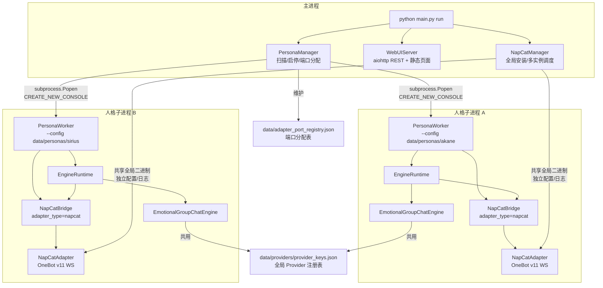
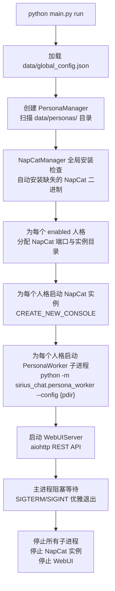
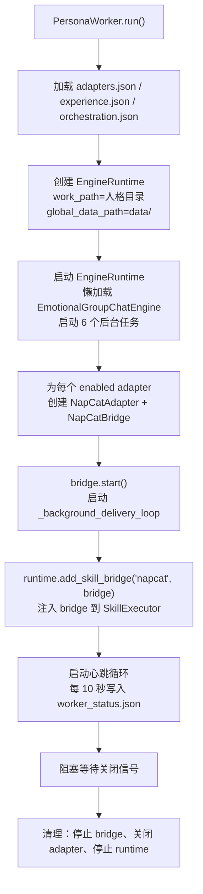
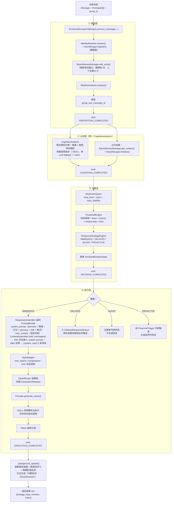
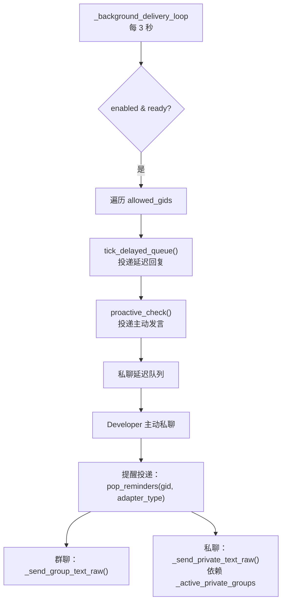

# Sirius Chat 全量架构与流程图

本文档描述 v1.0 多人格架构的真实执行路径与模块边界，重点覆盖：

- 主进程（`PersonaManager`）如何扫描、调度和启停多个人格
- 单个人格子进程（`PersonaWorker`）如何加载配置、启动 `EngineRuntime` 与 `NapCatBridge`
- `EmotionalGroupChatEngine` 的四层认知架构流水线
- 提醒系统从创建到投递的完整链路
- 数据隔离、Provider 共享、NapCat 多实例与日志归档

> **v1.0 重大变更**：项目已从单 workspace 单会话模式演进为**多人格多进程异步架构**。`PersonaManager` 是生产环境唯一推荐入口；`WorkspaceRuntime` 等旧版兼容层仍保留在 `workspace/` 目录，但不再作为推荐调用方式。

---

## 1. 当前架构总览

### 当前版本的关键事实

| 层面 | 关键模块 | 职责 |
|------|---------|------|
| **主进程** | `PersonaManager` | 扫描人格目录、端口分配、启停调度、读取子进程心跳 |
| **主进程** | `WebUIServer` | aiohttp REST API + 静态管理面板，支持多人格状态查看与配置 |
| **主进程** | `NapCatManager` | 全局 NapCat 安装检查/自动安装；为每个人格创建独立实例目录 |
| **子进程** | `PersonaWorker` | 单个人格独立运行入口：加载配置、创建 EngineRuntime、启动 NapCatBridge、心跳 |
| **子进程** | `EngineRuntime` | 单个人格运行时封装：懒加载 EmotionalGroupChatEngine，注入 SkillBridge |
| **子进程** | `NapCatBridge` | QQ 群聊/私聊桥接：接收 OneBot 事件、渲染 prompt、调用 engine、后台投递 |
| **核心** | `EmotionalGroupChatEngine` | v1.0 唯一引擎：四层认知架构（感知→认知→决策→执行）+ 三层记忆底座 |

- **数据隔离**：每个人格拥有独立的 `data/personas/{name}/` 目录，包含 `persona.json`、`adapters.json`、`experience.json`、`orchestration.json`、以及运行时的 `memory/`、`diary/`、`engine_state/`、`logs/`。
- **Provider 全局共享**：所有人格共用 `data/providers/provider_keys.json`。`EngineRuntime._build_provider()` 优先从全局位置加载 `ProviderRegistry`，回退到人格目录（兼容旧版）。
- **NapCat 多实例**：`NapCatManager.for_persona(global_install_dir, persona_name)` 创建 `napcat/instances/{name}/` 目录，共享全局二进制（`NapCatWinBootMain.exe` 等），拥有独立配置和日志。
- **端口分配**：`PersonaManager` 维护 `data/adapter_port_registry.json`，从 `global_config.napcat_base_port`（默认 3001）递增自动分配。每个 NapCat adapter 的 `ws_url` 格式为 `ws://localhost:{port}`。
- **日志归档**：`persona_worker.py` 启动时自动调用 `setup_log_archival()`，将旧的 `logs/worker.log` 按时间戳移入 `logs/archive/`，再创建新日志。
- **心跳机制**：子进程每 10 秒写入 `engine_state/worker_status.json`，主进程通过 `get_status()` 读取。

---

## 2. 主进程启动流

### 职责分工

- **`PersonaManager`**：拥有所有人格的生命周期。`create_persona()` 创建新人格目录与默认配置；`start_persona()` 启动单个人格（含 NapCat 自动管理）；`run_all()` 批量启动所有 enabled 人格；`get_logs()` 读取 `logs/worker.log`。
- **`NapCatManager`**：只管理 NapCat 全局二进制和多实例目录，不介入对话生成。`start(qq_number)` 在独立窗口启动 NapCat；`stop()` 终止实例。
- **`WebUIServer`**：只暴露 REST API 和静态页面，不直接操作 NapCat 进程。

---

## 3. 人格子进程启动流

### 子进程内的关键协作

- `PersonaWorker` 为每个 `NapCatAdapterConfig` 创建一个 `NapCatAdapter`（WebSocket 连接）和一个 `NapCatBridge`（事件处理 + 后台投递）。
- `NapCatBridge` 的 `config` 包含 `allowed_group_ids`、`allowed_private_user_ids`、`enable_group_chat`、`enable_private_chat`、`peer_ai_ids` 等。
- `EngineRuntime.add_skill_bridge(adapter_type, bridge)` 将 bridge 注入 `SkillExecutor._bridges`，使平台专属 SKILL（如 `send_image`）能拿到正确的 bridge。
- 所有 bridge 共享同一个 `EngineRuntime` 和同一个 `EmotionalGroupChatEngine`；每个 bridge 有自己的 `allowed_gids` 配置，但 engine 的 `_pending_reminders` 是共享的。

---

## 4. v1.0 Emotional 引擎单轮消息执行流

> Emotional 路径通过 `EmotionalGroupChatEngine.process_message(message, participants, group_id)` 处理单轮消息。引擎内部采用四层认知架构，每层职责单一、可独立测试。

### Emotional 路径需要特别注意的语义

- **群隔离是 P0**：所有记忆操作必须携带 `group_id`。`UserManager.entries` 为 `{group_id: {user_id: UserProfile}}` 双层字典。
- **四层认知架构**：感知 → 认知 → 决策 → 执行，每层通过 `SessionEventBus` 发出事件，外部可订阅监控。
- **统一认知分析器**：`CognitionAnalyzer` 联合分析情绪+意图，规则引擎覆盖 ~90% 情况（零 LLM 成本），复杂情况单次 LLM fallback（~10% 命中）。
- **简化记忆模型**：
  - `BasicMemoryManager`：按群滑动窗口（硬限制 30 条，上下文窗口 5 条），含热度计算（RhythmAnalyzer）。当群体变冷（heat < 0.25）且沉默 > 300s 时，上下文窗口外消息归档为日记素材。
  - `DiaryManager`：LLM 生成的群聊摘要，含关键词和 source_ids 回链基础记忆。支持 sentence-transformers 嵌入索引（可选）和关键词回退搜索。检索按 token 预算（默认 800 tokens）截断。
  - `ContextAssembler`：将基础记忆最近 n 条以 XML 格式嵌入 system prompt（`<conversation_history><message speaker="..." user_id="..." role="...">content</message></conversation_history>`），日记检索 top_k 条同样注入 system_prompt，最终只返回 `[system, user]` 2 条消息；`_generate()` 自动清洗模型仿写的 `<conversation_history>` 标签。
  - `GlossaryManager`：AI 自身名词解释，替代旧 AutobiographicalMemory。
  - `SemanticMemoryManager`：群语义画像（氛围历史、群体规范、关系状态），已实装持久化、被动学习、氛围记录与关系状态更新。
- **四种响应策略**：
  - `IMMEDIATE`：直接生成回复（高 urgency 或被 @ 时）。
  - `DELAYED`：入延迟队列，等待话题间隙或合并后触发。
  - `SILENT`：不回复，仅后台观察与学习。
  - `PROACTIVE`：由外部触发器（时间/记忆/情感）决定何时发起。
- **后台任务**（`start_background_tasks()` / `stop_background_tasks()`）共 6 个：
  - 延迟队列 ticker（每 3 秒，由 bridge 驱动）
  - 主动触发 checker（每 60 秒）
  - 日记生成 promoter（可配置间隔）
  - 日记 consolidator（可配置间隔）
  - 开发者主动私聊 checker（可配置间隔）
  - **提醒检查器 `_bg_reminder_checker`**（每 10 秒）
- **状态持久化**：`save_state()` / `load_state()` 持久化 basic memory、assistant emotion、group timestamps、diary index 到 `memory/` 目录。
- **Token 追踪**：`_generate()` 中估算 input/output tokens，记录到 `token_usage_records`。

---

## 5. 后台投递循环

`NapCatBridge._background_delivery_loop()` 每 3 秒执行一次，负责投递以下四类异步消息：

### 提醒投递的特殊机制

提醒系统涉及三个独立组件的协作：

1. **`reminder` SKILL**（`sirius_chat/skills/builtin/reminder.py`）：
   - 创建/列出/取消提醒记录
   - 支持 `adapter_type` 参数（可选），用于指定通过哪个 adapter 投递
   - 记录保存到 `{work_path}/skill_data/reminder.json`

2. **`EmotionalGroupChatEngine._check_due_reminders()`**（后台任务，每 10 秒）：
   - 扫描 `reminder.json` 中到期的提醒
   - 调用 `_generate_reminder_message()` 用 LLM 生成人格化的提醒消息
   - 将生成的消息放入 `_pending_reminders[group_id]`
   - 若 `group_id` 以 `private_` 开头，自动加入 `_active_private_groups`（确保 engine 重启后仍能投递）

3. **`NapCatBridge._background_delivery_loop()`**（每 3 秒）：
   - 群聊提醒：遍历 `allowed_gids`，`pop_reminders(gid, adapter_type)` 并发送
   - 私聊提醒：遍历 `_active_private_groups`，`pop_reminders(gid, adapter_type)` 并发送
   - `adapter_type` 过滤确保多 adapter 场景下每个 bridge 只投递属于自己的提醒

### 提醒创建时的上下文注入

当 AI 在对话中调用 `[SKILL_CALL: reminder | {"action": "create", ...}]` 时：

1. `SkillExecutor` 执行 `reminder.run()`，将提醒记录存入 `SkillDataStore`
2. 引擎检测到 skill 名称为 `reminder` 且 action 为 `create`，调用 `_inject_group_id_into_latest_reminder(group_id)`
3. 该方法将当前 `group_id` 和 `adapter_type`（来自 `message.adapter_type`）注入最新创建的提醒记录
4. 如果 skill 调用时未指定 `adapter_type`，引擎会自动注入当前 adapter_type

---

## 6. 分层视图与模块职责

| 分层 | 关键模块 | 主要职责 |
| --- | --- | --- |
| **入口层** | `main.py` | 统一 CLI 入口：无参数启动 WebUI；`run` 启动所有人格 + NapCat + WebUI；`persona` 子命令管理单个人格 |
| **主进程管理层** | `sirius_chat/persona_manager.py` | 多人格生命周期管理：扫描、创建、删除、迁移、启停、监控、日志读取 |
| **子进程入口** | `sirius_chat/persona_worker.py` | 单个人格独立运行入口：加载配置、创建 EngineRuntime、启动 NapCatBridge、心跳、日志归档 |
| **子进程运行时** | `sirius_chat/platforms/runtime.py` | `EngineRuntime`：懒加载 EmotionalGroupChatEngine，管理 provider 和 skill bridge 注入 |
| **平台桥接层** | `sirius_chat/platforms/napcat_bridge.py`、`napcat_adapter.py`、`napcat_manager.py` | NapCat OneBot v11 WebSocket 适配、QQ 群聊/私聊事件处理、后台投递循环、setup wizard |
| **认知编排层** | `core/emotional_engine.py`、`core/cognition.py`、`core/response_strategy.py`、`core/threshold_engine.py`、`core/rhythm.py`、`core/response_assembler.py` | 四层认知架构、统一认知分析、响应策略、动态阈值、对话节奏、prompt 组装 |
| **记忆层** | `memory/basic/`、`memory/diary/`、`memory/user/`、`memory/glossary/`、`memory/semantic/`、`memory/context_assembler.py` | 基础记忆（工作窗口+热度+归档）、日记记忆（LLM生成+检索）、用户管理、名词解释、语义记忆、上下文组装器 |
| **Provider 层** | `providers/base.py`、`providers/routing.py`、各 provider 文件 | 统一请求协议、provider 注册表、自动路由、具体上游接入；`providers/middleware/` 框架已实现但当前未接入调用链 |
| **SKILL 层** | `skills/registry.py`、`skills/executor.py`、`skills/data_store.py`、`skills/builtin/` | SKILL 注册、依赖解析、执行与 data store；内置技能含 system_info、desktop_screenshot、learn_term、url_content_reader、bing_search、file_read、file_list、file_write、reminder |
| **配置层** | `sirius_chat/persona_config.py` | 人格级配置模型：adapters、experience、paths |
| **WebUI 层** | `webui/server.py`、`webui/static/` | aiohttp REST API + 管理面板（Dashboard + 配置面板） |
| **工具层** | `token/` | token 统计与 SQLite 持久化；`cache/`、`performance/` 框架已实现但当前未接入调用链 |

---

## 7. 文件所有权与路径语义

### 全局路径（所有人格共用）

| 路径 | 说明 |
| --- | --- |
| `data/global_config.json` | 全局配置：webui_host/port、auto_manage_napcat、log_level |
| `data/providers/provider_keys.json` | Provider 凭证注册表（所有人格共用） |
| `data/adapter_port_registry.json` | NapCat 端口分配表（PersonaManager 维护） |
| `data/rbac.json` | 权限控制配置 |

### 人格隔离路径（`data/personas/{name}/`）

| 路径 | 生产者 | 用途 |
| --- | --- | --- |
| `persona.json` | `PersonaStore` | 人格定义（PersonaProfile）：name、aliases、personality_traits、backstory 等 |
| `orchestration.json` | `OrchestrationStore` | 模型编排：analysis_model、chat_model、vision_model |
| `adapters.json` | `PersonaAdaptersConfig` | 平台适配器列表（NapCatAdapterConfig 等） |
| `experience.json` | `PersonaExperienceConfig` | 体验参数：reply_mode、engagement_sensitivity、max_skill_rounds 等 |
| `engine_state/persona.json` | `PersonaStore.save()` | 运行时人格状态持久化 |
| `engine_state/worker_status.json` | `PersonaWorker._write_status()` | 子进程心跳（status、pid、heartbeat_at） |
| `engine_state/enabled` | WebUI/CLI | 启停标志文件（`1` 启用，`0` 禁用） |
| `engine_state/bridge_state.json` | `ConfigStore` | Bridge 内部状态（setup_completed 等） |
| `memory/basic/<group_id>.jsonl` | `BasicMemoryFileStore` | 基础记忆条目 |
| `memory/diary/<group_id>.jsonl` | `DiaryManager` | 日记条目 |
| `memory/diary/index/<group_id>.json` | `DiaryIndexer` | 日记索引（关键词+可选嵌入） |
| `memory/glossary/terms.json` | `GlossaryManager` | 名词解释 |
| `memory/semantic/` | `SemanticMemoryManager` | 群语义画像（氛围历史、群体规范、关系状态） |
| `skill_data/reminder.json` | `SkillDataStore` | 提醒数据存储 |
| `skill_data/*.json` | `SkillDataStore` | 其他 SKILL 的独立数据存储 |
| `logs/worker.log` | `FlushingFileHandler` | 子进程主日志（启动时自动归档旧日志到 `logs/archive/`） |
| `image_cache/` | `NapCatBridge` | 群聊图片缓存 |

### NapCat 多实例路径

| 路径 | 说明 |
| --- | --- |
| `napcat/NapCatWinBootMain.exe` | 全局共享二进制 |
| `napcat/instances/{persona_name}/` | 人格专属实例目录 |
| `napcat/instances/{persona_name}/config/napcat_{qq}.json` | 独立 NapCat 配置 |
| `napcat/instances/{persona_name}/config/onebot11_{qq}.json` | 独立 OneBot v11 配置 |
| `napcat/instances/{persona_name}/logs/` | 独立日志目录 |

---

## 8. Provider 路由

`ProviderRegistry`（全局共享，从 `data/providers/provider_keys.json` 加载）维护所有已配置的 provider。`EngineRuntime._build_provider()` 创建 `AutoRoutingProvider` 或直接使用显式 provider。

当前路由规则：

- 优先看 `ProviderConfig.models` 的显式模型列表。
- 其次看 `healthcheck_model` 的精确匹配。
- 都未命中时，回退到第一个启用的 provider。
- `EmotionalGroupChatEngine` 内部通过 `ModelRouter` 按任务类型（`emotion_analyze` / `intent_analyze` / `response_generate` / `memory_extract` / `proactive_generate` / `vision`）选择模型、温度和 token 上限；urgency ≥ 80 时切换更强模型。

---

## 9. 人格系统提示词构建

`PersonaProfile.build_system_prompt()` 从人格字段构建系统提示词，包含以下区块：

1. **【角色】** - `name`
2. **身份锚点** - `persona_summary`（若为空则取 `backstory` 第一句）
3. **【背景故事】** - 完整的 `backstory`（v1.0.1+ 新增）
4. **【人格底色】** - `personality_traits` + `core_values` + `flaws`
5. **【情绪反应】** - `emotional_baseline` + `stress_response` + `empathy_style`
6. **【关系模式】** - `social_role` + `boundaries`
7. **【说话方式】** - `communication_style` + `speech_rhythm` + `catchphrases` + `humor_style`
8. **【回应习惯】** - `reply_frequency` + `taboo_topics` + `preferred_topics`
9. **【场景行为】** - 群聊场景指令

若设置了 `full_system_prompt`，则完全覆盖上述自动构建的提示词。

---

## 10. 关键运行产物

| 产物 | 来源 | 被谁消费 |
| --- | --- | --- |
| `worker.log` | `PersonaWorker._main()` | WebUI/CLI 日志查看；启动时自动归档到 `logs/archive/` |
| `worker_status.json` | `PersonaWorker._write_status()` | `PersonaManager.get_status()` 监控子进程健康 |
| `BasicMemoryManager` 窗口 | `EmotionalGroupChatEngine` | 当前群对话上下文、RhythmAnalyzer 输入、热度计算 |
| `DiaryManager` 条目 | `EmotionalGroupChatEngine._bg_diary_promoter()` | 群聊摘要、长期记忆检索素材 |
| `SemanticMemoryManager` 画像 | `EmotionalGroupChatEngine` | ThresholdEngine 关系因子、ResponseAssembler 群风格 |
| `_pending_reminders` | `EmotionalGroupChatEngine._check_due_reminders()` | `NapCatBridge._background_delivery_loop()` 定时投递 |
| `SessionEventBus` 事件流 | `EmotionalGroupChatEngine` | 外部监控、统计、调试 |
| `skill_data/reminder.json` | `reminder` SKILL | `_bg_reminder_checker` 扫描到期提醒 |

---

## 11. 文档同步规则

当以下任一条件发生变化时，必须同步检查本文档：

1. **入口层改变**：`main.py` 子命令、推荐调用方式变化。
2. **多人格管理层改变**：`PersonaManager`、`PersonaWorker` 的启停调度、端口分配、心跳机制变化。
3. **NapCat 多实例改变**：`NapCatManager` 的安装路径、实例目录结构、配置格式变化。
4. **engine 主流程改变**：`EmotionalGroupChatEngine` 的认知架构、后台任务、SKILL 循环、提醒系统变化。
5. **记忆存储布局变化**：新增/删除/迁移 `memory/`、`diary/`、`semantic/`、`engine_state/` 路径。
6. **平台桥接层改变**：`NapCatBridge` 的事件处理、后台投递、提醒投递逻辑变化。
7. **Provider 行为改变**：路由规则、注册表格式、全局共享机制变化。

推荐同步顺序：

1. 先更新 `docs/full-architecture-flow.md`。
2. 再同步 `docs/architecture.md`。
3. 若外部用法变化，再同步 `docs/external-usage.md` 和 `README.md`。
4. 最后同步受影响的模块文档（`engine-emotional.md`、`skill-system.md`、`persona-system.md` 等）。

---

> **文档版本**：v1.0.1
> **最后更新**：2026-04-30
> **对应代码分支**：`master`
