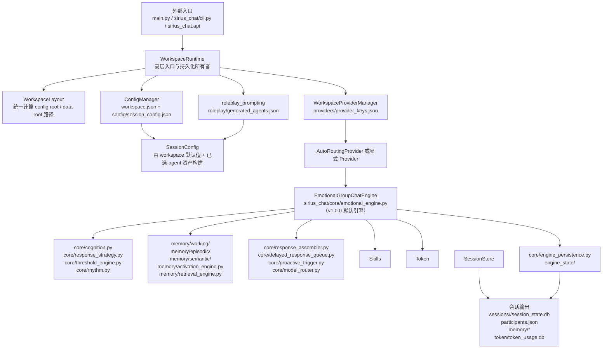
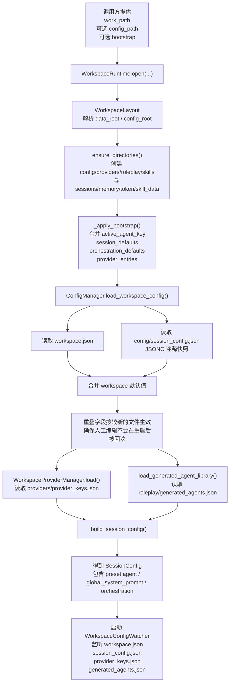
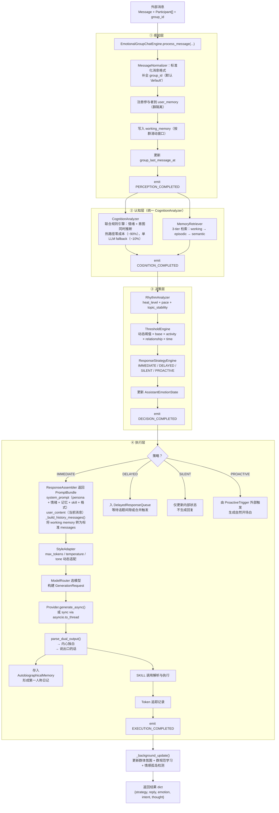
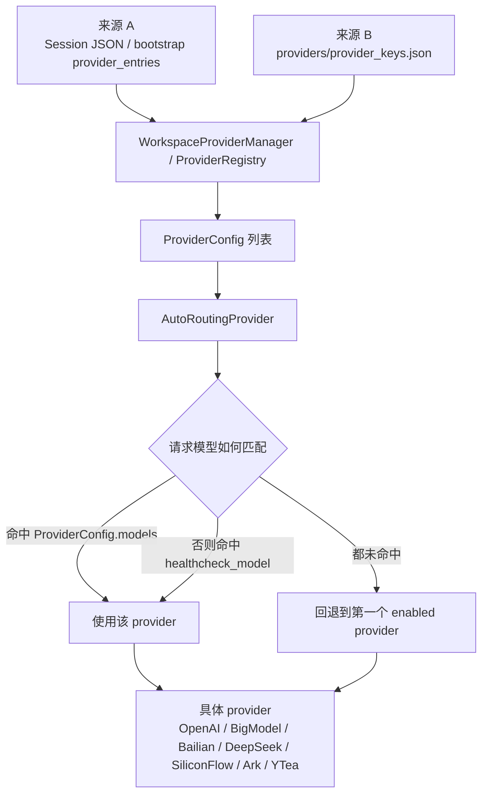
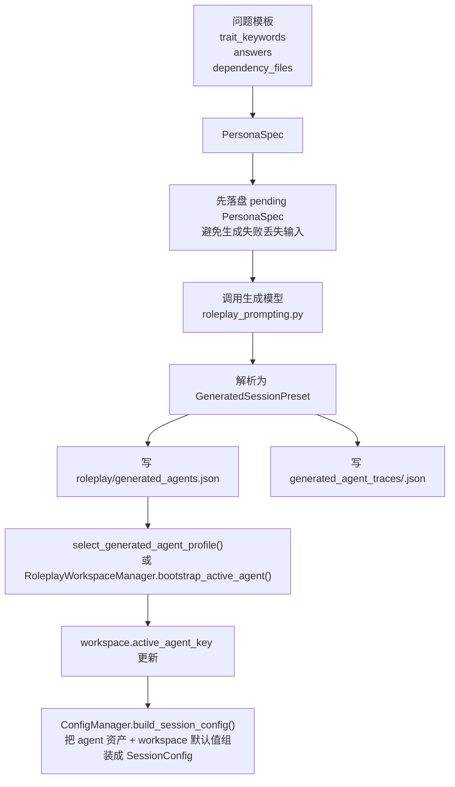

# Sirius Chat 全量架构与流程图

本文档描述当前代码的真实执行路径与模块边界，重点覆盖：

- 入口层如何进入 workspace 与 session
- `WorkspaceRuntime`、`ConfigManager`、`WorkspaceLayout` 的协作关系
- **Legacy 引擎** `AsyncRolePlayEngine` 的单轮执行流水线
- **v0.28 新引擎** `EmotionalGroupChatEngine` 的四层认知架构流水线
- provider 路由、roleplay 资产、session store 与 memory 的落盘位置

> **v0.28 重大变更**：新增 `EmotionalGroupChatEngine`（情感化群聊引擎），与 legacy `AsyncRolePlayEngine` 并存。两者不共享内部状态；通过 `main.py --engine {legacy,emotional}` 或 `WorkspaceRuntime.create_emotional_engine()` 切换。

历史迁移文档只用于说明版本演进，不作为当前架构的事实来源；当前实现以本文档、[docs/architecture.md](docs/architecture.md) 和实际代码为准。

---

## 1. 当前架构总览

### 当前版本的几个关键事实

- 推荐外部入口是 `open_workspace_runtime(...)` / `WorkspaceRuntime`，而不是让调用方自己管理文件布局。
- `WorkspaceLayout` 是路径的单一事实来源，决定配置资产与运行态数据分别落在哪里。
- **v1.0.0 默认引擎** `EmotionalGroupChatEngine` 的实现位于 `sirius_chat/core/emotional_engine.py`，采用四层认知架构（感知→认知→决策→执行）与三层记忆底座（工作→情景→语义）。
- **Legacy 引擎 `AsyncRolePlayEngine` 已归档**到 `sirius_chat/core/_legacy/`，不再作为推荐路径。
- `sirius_chat/async_engine/` 承担 legacy 兼容导出、提示词与工具函数。
- `UserMemoryManager` 已改为群隔离布局：`entries` 为 `{group_id: {user_id: UserMemoryEntry}}` 双层字典；旧格式通过迁移脚本自动升级。
- SKILL runtime 会先加载包内置技能，再加载 workspace `skills/`；同名 workspace 文件覆盖内置实现。
- 用户态记忆、事件记忆、自身记忆、session store、token store 都已经收敛到 workspace 语义下。
- v1.0.0 新增存储路径：`episodic/`（情景记忆）、`semantic/`（语义记忆）、`engine_state/`（引擎运行态持久化）。

---

## 2. Workspace 启动与配置流

### 这条链路的职责分工

- `WorkspaceRuntime`：拥有初始化、配置刷新、session 锁、store 生命周期和参与者元数据写回。**v1.0.0 新增**：`create_emotional_engine()` 工厂方法，为新引擎绑定 workspace provider 与 work_path。
- `WorkspaceLayout`：决定所有目录与文件名，不让外部调用方拼接路径。**v1.0.0 新增**：`episodic/`、`semantic/`、`engine_state/` 目录纳入布局。
- `ConfigManager`：负责 workspace 级默认值的读写，以及从 workspace + roleplay 资产构建可运行的 `SessionConfig`。
- `WorkspaceProviderManager`：只管理 provider 注册表，不参与对话编排。
- `roleplay_prompting`：只管理 agent 资产与提示词生成，不直接执行业务会话。

---

## 3. v0.28 Emotional 引擎单轮消息执行流

> Emotional 路径通过 `EmotionalGroupChatEngine.process_message(...)` 处理单轮消息。引擎内部采用四层认知架构，每层职责单一、可独立测试。

### Emotional 路径需要特别注意的语义

- **群隔离是 P0**：所有记忆操作必须携带 `group_id`。`UserMemoryManager.entries` 为 `{group_id: {user_id: Entry}}` 双层字典。
- **四层认知架构**：感知 → 认知 → 决策 → 执行，每层通过 `SessionEventBus` 发出事件，外部可订阅监控。
- **统一认知分析器**：`CognitionAnalyzer` 联合分析情绪+意图，规则引擎覆盖 ~90% 情况（零 LLM 成本），复杂情况单次 LLM fallback（~10% 命中）。情绪结果自然流入意图紧急度评分，无需额外异步边界。
- **三层记忆底座**：
  - `WorkingMemoryManager`：按群滑动窗口，最近 N 轮，关键信息保护。
  - `EpisodicMemoryManager`：结构化事件存储，支持激活度遗忘曲线。
  - `SemanticMemoryManager`：用户画像 + 群体规范，周期性 consolidation 更新。
- **四种响应策略**：
  - `IMMEDIATE`：直接生成回复（高 urgency 或被 @ 时）。
  - `DELAYED`：入延迟队列，等待话题间隙或合并后触发。
  - `SILENT`：不回复，仅后台观察与学习。
  - `PROACTIVE`：由外部触发器（时间/记忆/情感）决定何时发起。
- **后台任务**（`start_background_tasks()` / `stop_background_tasks()`）：
  - 延迟队列 ticker（每 10 秒）
  - 主动触发 checker（每 60 秒）
  - 记忆 promoter（每 5 分钟，working → episodic）
  - 语义整合 consolidator（每 10 分钟，episodic → semantic）
- **状态持久化**：`save_state()` / `load_state()` 通过 `EngineStateStore` 持久化 working memory、assistant emotion、token usage 到 `engine_state/` 目录。
- **Token 追踪**：`_generate()` 中估算 input/output tokens，记录到 `token_usage_records`，随状态持久化。

---

## 5. 分层视图与模块职责

| 分层 | 关键模块 | 主要职责 |
| --- | --- | --- |
| 入口层 | `main.py`、`sirius_chat/cli.py`、`sirius_chat/api/*` | 接收外部输入、暴露稳定 API、拼接最少的运行参数。**v1.0.0 新增**：`main.py --engine {legacy,emotional}` 切换 |
| Workspace 层 | `workspace/layout.py`、`workspace/runtime.py`、`workspace/config_watcher.py`、`workspace/roleplay_manager.py` | 路径布局、配置热刷新、session 队列与锁、静默批处理、participants 元数据、roleplay 资产与 workspace 默认值联动。**v1.0.0 新增**：`create_emotional_engine()` 工厂方法 |
| 配置构建层 | `config/models.py`、`config/manager.py`、`config/jsonc.py`、`config/helpers.py` | `WorkspaceConfig` / `SessionConfig` / `OrchestrationPolicy` 契约、JSON/JSONC 读写、workspace 默认值与 orchestration 构造 |
| **Legacy 编排核心层** | `core/engine.py`、`core/chat_builder.py`、`core/memory_prompt.py`、`core/memory_runner.py`、`core/engagement_pipeline.py`、`core/heat.py`、`core/intent_v2.py`、`core/events.py` | 单轮消息编排、记忆任务、意图分析、参与决策、提示词上下文构造、事件总线 |
| **v0.28 新编排核心层** | `core/emotional_engine.py`、`core/intent_v3.py`、`core/emotion.py`、`core/response_strategy.py`、`core/threshold_engine.py`、`core/rhythm.py`、`core/response_assembler.py`、`core/delayed_response_queue.py`、`core/proactive_trigger.py`、`core/model_router.py`、`core/engine_persistence.py` | 四层认知架构、情感分析、响应策略、动态阈值、对话节奏、共情生成、延迟队列、主动触发、模型路由、状态持久化 |
| 兼容与辅助层 | `async_engine/prompts.py`、`async_engine/orchestration.py`、`async_engine/utils.py`、`async_engine/__init__.py` | 提示词生成、任务常量与配置、辅助工具、向后兼容导出 |
| 记忆层 | `memory/user/`、`memory/event/`、`memory/self/`、`memory/quality/` | 用户识别与事实记忆、事件记忆、自身记忆、离线质量评估能力 |
| **v0.28 新记忆层** | `memory/working/`、`memory/episodic/`、`memory/semantic/`、`memory/activation_engine.py`、`memory/retrieval_engine.py`、`memory/migration/` | 工作记忆滑动窗口、情景记忆结构化存储、语义记忆画像、激活度遗忘曲线、三级检索、数据迁移 |
| Provider 层 | `providers/base.py`、`providers/routing.py`、各 provider 文件、`providers/middleware/` | 统一请求协议、provider 注册表、自动路由、具体上游接入、中间件增强 |
| 会话与统计层 | `session/store.py`、`session/runner.py`、`token/store.py`、`token/usage.py`、`token/analytics.py` | Transcript 持久化、兼容运行器、token 归档、跨会话分析 |
| 扩展层 | `skills/`、`cache/`、`performance/` | SKILL 注册、依赖解析、执行与 data store；缓存框架；性能采样与基准 |

### 真实的 engine 位置

- **v1.0.0 默认引擎**：`EmotionalGroupChatEngine` 的实现位于 `sirius_chat/core/emotional_engine.py`。
- `sirius_chat/core/cognition.py`：统一情绪+意图分析器（`CognitionAnalyzer`）。
- `sirius_chat/core/response_assembler.py`：返回 `PromptBundle`（system_prompt + user_content），负责指令级上下文组装；`<think>` / `<say>` 双输出解析。历史消息由引擎通过 `_build_history_messages()` 独立管理为标准 OpenAI messages。
- `sirius_chat/memory/autobiographical/`：自传体记忆（第一人称体验记录）。
- **Legacy 归档**：`AsyncRolePlayEngine` 的实现位于 `sirius_chat/core/_legacy/engine.py`，不再维护新功能。

---

## 6. 文件所有权与路径语义

`WorkspaceLayout` 把路径分成两类：

- config root：配置资产、provider 注册表、roleplay 资产、skills 代码
- data root：会话状态、记忆数据、token 计量、skill_data

| 路径 | 所属 root | 生产者 | 用途 |
| --- | --- | --- | --- |
| `workspace.json` | config root | `ConfigManager.save_workspace_config()` | 机器可读的 workspace 清单与默认值 |
| `config/session_config.json` | config root | `ConfigManager.save_workspace_config()`、CLI 默认模板 | 人类可编辑的 JSONC 快照 |
| `providers/provider_keys.json` | config root | `WorkspaceProviderManager` | provider 注册表、healthcheck 与模型映射 |
| `roleplay/generated_agents.json` | config root | `roleplay_prompting.py` | 已生成 agent 资产库与选中 agent |
| `roleplay/generated_agent_traces/<agent_key>.json` | config root | `roleplay_prompting.py` | 提示词生成完整轨迹 |
| `skills/` | config root | `SkillRegistry`、runtime 初始化 | SKILL 源文件与 README 引导；同名 workspace 文件可覆盖内置 SKILL |
| `sessions/<session_id>/session_state.db` | data root | `SqliteSessionStore` | 默认结构化会话存储（legacy 路径） |
| `sessions/<session_id>/session_state.json` | data root | `JsonSessionStore` | 可选 JSON store（legacy 路径） |
| `sessions/<session_id>/participants.json` | data root | `WorkspaceRuntime` | 会话参与者与主用户元数据 |
| `user_memory/groups/<group_id>/<user_id>.json` | data root | `UserMemoryFileStore` | **v0.28**：群隔离用户记忆 |
| `user_memory/groups/<group_id>/group_state.json` | data root | `SemanticMemoryManager` | **v0.28**：群级记忆（氛围、规范） |
| `event_memory/<group_id>/events.json` | data root | `EventMemoryFileStore` | **v0.28**：群隔离事件记忆 |
| `memory/self_memory.json` | data root | `SelfMemoryFileStore` | AI 自身记忆落盘 |
| `episodic/<group_id>.jsonl` | data root | `EpisodicMemoryManager` | **v0.28**：情景记忆条目（每群一行一个 JSON） |
| `semantic/users/<group_id>_<user_id>.json` | data root | `SemanticMemoryManager` | **v0.28**：用户语义画像 |
| `semantic/groups/<group_id>.json` | data root | `SemanticMemoryManager` | **v0.28**：群体语义画像 |
| `engine_state/` | data root | `EngineStateStore` | **v0.28**：引擎运行态（working memory、assistant emotion、token usage） |
| `token/token_usage.db` | data root | `TokenUsageStore` | 跨会话 token 使用记录 |
| `skill_data/*.json` | data root | `SkillDataStore` | 每个 SKILL 的独立数据存储 |
| `primary_user.json` | data root | `JsonPersistentSessionRunner` / `main.py` | 兼容入口保留文件，不是主架构核心 |

### `workspace.json` 与 `config/session_config.json` 的关系

- `workspace.json`：偏机器侧、结构稳定、便于 runtime 直接读取。
- `config/session_config.json`：偏人工编辑，带注释，用于暴露完整可配置项。
- 两者存在重叠字段时，当前实现按文件修改时间选择较新的版本作为事实来源。

---

## 7. Provider 路由流

### 当前路由规则

- 优先看 `ProviderConfig.models` 的显式模型列表。
- 其次看 `healthcheck_model` 的精确匹配。
- 都未命中时，回退到第一个启用的 provider。
- 如果 runtime 没有显式注入 provider，且 workspace 注册表中有 provider，`WorkspaceRuntime` 会优先创建 `AutoRoutingProvider`。
- 当 `provider_keys.json` 被 watcher 检测到变化时，runtime 会重建 engine，确保新 provider 配置真正生效。
- **v1.0.0 新增**：`EmotionalGroupChatEngine` 内部通过 `ModelRouter` 按任务类型（`emotion_analyze` / `intent_analyze` / `response_generate` / `memory_extract`）选择模型、温度和 token 上限；urgency ≥ 80 时切换更强模型，urgency ≥ 95 时最大化 token 上限。

---

## 8. Roleplay 资产与 SessionConfig 构建流

### 这一层的边界

- `roleplay_prompting.py` 只负责生成、持久化和选择 agent 资产。
- `WorkspaceRuntime` 不生成人格，只消费已经选中的资产。
- `RoleplayWorkspaceManager` 是“选中 agent + 更新 workspace 默认值”的组合封装。
- **v0.28 说明**：`EmotionalGroupChatEngine` 当前不直接消费 roleplay 资产；`ResponseAssembler` 负责构建 `PromptBundle`（system_prompt 注入 persona、情绪、共情、记忆、skill 与输出格式；user_content 为当前消息格式化内容）。历史对话通过 `_build_history_messages()` 从 `working_memory` 提取，转为标准 `user`/`assistant` messages 数组传入 `_generate()`。

---

## 9. 关键运行产物

| 产物 | 来源 | 被谁消费 |
| --- | --- | --- |
| `Transcript.messages` | `AsyncRolePlayEngine` | 对话展示、session store（legacy 路径） |
| `Transcript.user_memory` | `UserMemoryManager` | 提示词注入、识人、participants 写回；`profile.aliases` 为强绑定，`runtime.inferred_aliases` 为弱线索 |
| `Transcript.reply_runtime` | 引擎运行时 | `reply_mode=auto` 节奏控制（legacy 路径） |
| `Transcript.session_summary` | 自动压缩逻辑 | 后续主模型上下文（legacy 路径） |
| `Transcript.token_usage_records` | provider 调用后 | 内存统计与 `TokenUsageStore` 持久化（legacy 路径） |
| `SessionEventBus` 事件流 | `AsyncRolePlayEngine` / `EmotionalGroupChatEngine` | `subscribe()` / `on_reply` 外部回调 |
| `WorkingMemoryManager` 窗口 | `EmotionalGroupChatEngine` | 当前群对话上下文、RhythmAnalyzer 输入 |
| `EpisodicMemoryManager` 条目 | `EmotionalGroupChatEngine._bg_memory_promoter()` | 结构化事件查询、consolidation 源数据 |
| `SemanticMemoryManager` 画像 | `EmotionalGroupChatEngine._bg_consolidator()` | ThresholdEngine 关系因子、ResponseAssembler 群风格 |
| `EngineStateStore` 快照 | `EmotionalGroupChatEngine.save_state()` | 引擎重启后状态恢复 |
| `engine.token_usage_records` | `EmotionalGroupChatEngine._generate()` | Token 使用追踪与持久化；`_generate()` 接收 `system_prompt` + 标准 `messages` 列表，不再做字符串分割 |

---

## 10. 文档同步规则

当以下任一条件发生变化时，必须同步检查本文档：

1. 入口层改变：`main.py`、`cli.py`、`api/engine.py` 的推荐调用方式变化。
2. workspace 布局改变：`WorkspaceLayout` 新增、删除或迁移路径。
3. provider 行为改变：路由规则、注册表格式、支持平台变化。
4. engine 主流程改变：辅助任务、参与决策、SKILL 循环、消息压缩逻辑变化。
5. roleplay 资产流改变：`generated_agents.json`、trace、选中 agent 语义变化。
6. **v1.0.0 新增**：新引擎模块（`emotional_engine.py`、`intent_v3.py`、`emotion.py` 等）的行为或数据流变化。
7. **v1.0.0 新增**：记忆存储布局变化（群隔离、新增 `episodic/` / `semantic/` / `engine_state/` 路径）。

推荐同步顺序：

1. 先更新 `docs/full-architecture-flow.md`。
2. 再同步 [docs/architecture.md](docs/architecture.md)。
3. 若外部用法变化，再同步 [docs/external-usage.md](docs/external-usage.md) 和 [README.md](README.md)。
4. 最后同步 `.github/skills/` 下的相关 SKILL。

---

> **文档版本**：v0.28.0  
> **最后更新**：2026-04-17  
> **对应代码分支**：`feature/v0.28-emotional-group-chat`
