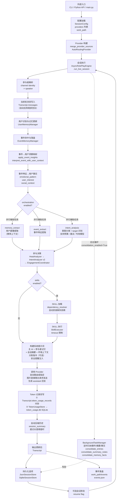
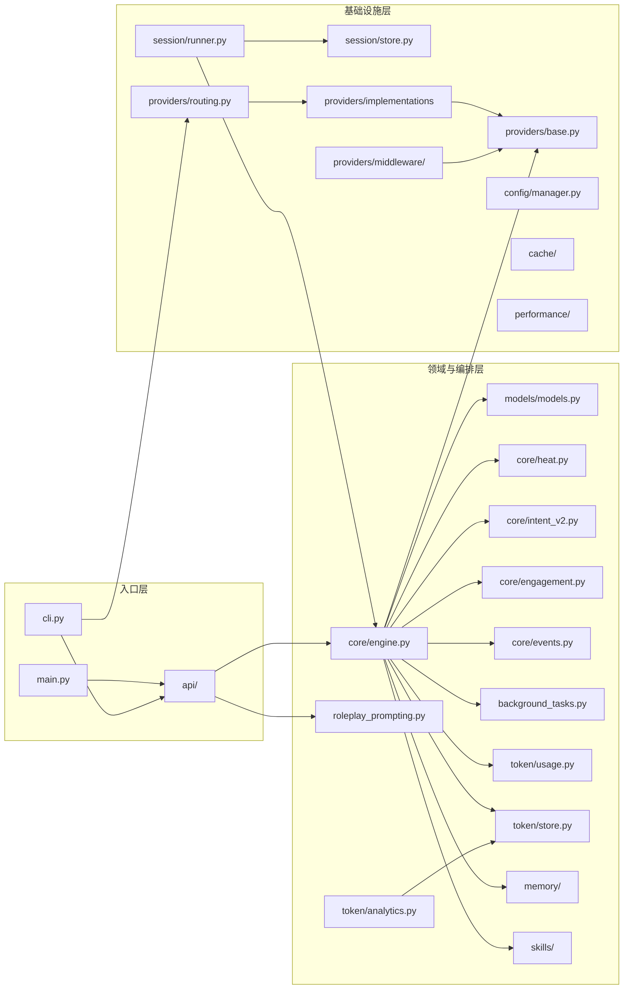
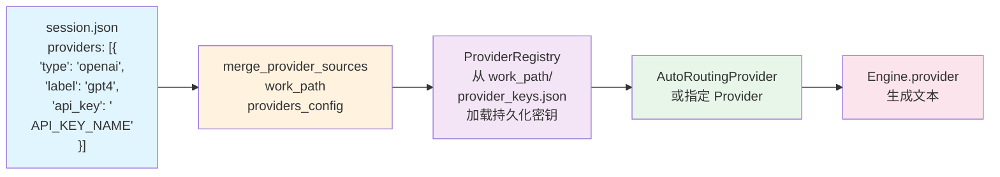

# Sirius Chat 全量架构与流程图

本文档给出项目的完整可读架构视图，覆盖：

- 端到端执行流程
- 关键模块边界
- 每个模块的输入/输出产物
- 代码更新后的文档同步要求

## 1. 全量端到端流程图

## 2. 模块分层图

## 3. Provider 构建流程（v1.0 统一格式）

**关键点**：
- v1.0 统一采用 `providers` 列表格式（删除向后兼容的 `provider` 单字段）
- `merge_provider_sources()` 签名简化：仅接收 `(work_path, providers_config)`
- 持久化密钥通过 `<work_path>/provider_keys.json` 管理，由 ProviderRegistry 自动加载
- SessionConfig 内部转为单一 Provider 实例（AutoRoutingProvider 或指定 Provider）
- 支持多 Provider 路由：AutoRoutingProvider 在运行时自动选择合适提供商

## 4. 模块输入/输出产物清单

| 模块 | 主要输入 | 主要输出/产物 |
| --- | --- | --- |
| `main.py` | 命令行参数、用户输入、`work_path`、`config.json` | `Transcript`、`transcript.json`、`session_config.persisted.json`、`primary_user.json`、`events/events.json` |
| `sirius_chat/cli.py` | `config.json`（含 `providers` 列表）、单轮用户输入 | 单轮 `Transcript`、`transcript.json` |
| `sirius_chat/api/` | 外部程序调用参数、`work_path` | 稳定对外函数与类型、`Transcript` |
| `sirius_chat/models/models.py` | 配置与消息数据 | 统一数据契约（`Message`、`Participant`、`Transcript` 等） |
| `sirius_chat/core/engine.py` | 初始化：`SessionConfig` + 可选已有 `Transcript`；逐条处理：`Message` + `Transcript` | 更新后的 `Transcript`、assistant 回复、编排统计与 token 记录 |
| `sirius_chat/core/heat.py` | 最近 N 条消息、时间窗口 | `HeatAnalysis`（heat_level / heat_score / active_participants / ai_participation_ratio） |
| `sirius_chat/core/intent_v2.py` | 用户消息文本、参与者列表、LLM provider | `IntentAnalysis`（意图类型 + target + reason + evidence_span）、skip_sections 建议 |
| `sirius_chat/core/engagement.py` | `HeatAnalysis`、`IntentAnalysis`、`engagement_sensitivity` | `EngagementDecision`（should_reply / engagement_score / reason）、频率限制检查 |
| `sirius_chat/core/events.py` | 对话上下文、事件特征原始数据 | 事件摘要、`SessionEvent` 数据结构 |
| `sirius_chat/background_tasks.py` | `BackgroundTaskConfig`、归纳回调函数 | 定时触发事件/摘要/事实归纳任务，写回持久化 |
| `sirius_chat/memory/` | 用户信息、对话历史、事件数据 | 记忆库、事件落盘、用户档案提取 |
| `sirius_chat/roleplay_prompting.py` | 角色问答、agent 名称、模型 | `GeneratedSessionPreset`、`generated_agents.json`、可直接创建的 `SessionConfig` |
| `sirius_chat/token/usage.py` | `Transcript.token_usage_records` | baseline 与按 actor/task/model 聚合报表（内存级） |
| `sirius_chat/token/store.py` | `TokenUsageRecord`、`session_id` | SQLite 持久化（`{work_path}/token_usage.db`）、跨会话查询 |
| `sirius_chat/token/analytics.py` | `TokenUsageStore` | 全局/会话/用户/任务/模型/时间维度分析报告 |
| `sirius_chat/session/store.py` | `Transcript` | JSON/SQLite 持久化状态文件 |
| `sirius_chat/session/runner.py` | `SessionConfig`、Provider、主用户输入、`work_path` | 自动持久化会话循环、主用户档案维护、恢复状态管理 |
| `sirius_chat/config/manager.py` | JSON 配置文件、环境变量 | 合并配置、环境变量覆盖、配置验证 |
| `sirius_chat/providers/base.py` | `GenerationRequest` | Provider 协议（同步/异步生成契约） |
| `sirius_chat/providers/middleware/` | `GenerationRequest`、中间件链配置 | 透明的 Provider 功能扩展（流控、重试、成本计量） |
| `sirius_chat/providers/routing.py` | `work_path`、`providers_config` 列表 | ProviderRegistry、`provider_keys.json`、最终路由选择 |
| `sirius_chat/providers/openai_compatible.py` | `GenerationRequest` | 模型文本回复、token 使用统计 |
| `sirius_chat/providers/siliconflow.py` | `GenerationRequest` | 模型文本回复、token 使用统计 |
| `sirius_chat/providers/volcengine_ark.py` | `GenerationRequest` | 模型文本回复、token 使用统计 |
| `sirius_chat/providers/mock.py` | `GenerationRequest` | 可预测测试回复 |
| `sirius_chat/cache/` | 缓存 key、模型响应值 | 缓存命中/未命中、LRU 淘汰、TTL 过期管理 |
| `sirius_chat/skills/` | SKILL 目录路径、SKILL 文件（`.py`）、`OrchestrationPolicy` 配置 | SKILL 注册表、依赖自动安装日志、`SkillResult`（执行结果/超时错误） |
| `sirius_chat/performance/` | 代码块/函数调用记录、基准参数 | 执行指标（时间、内存）、性能统计聚合、基准对比结果 |

## 4. 关键运行产物说明

- `Transcript.messages`: 会话全量消息（system/user/assistant），写入时自动去除尾部空白。
- `Transcript.user_memory`: 识人记忆状态（跨轮次延续）。
- `Transcript.session_summary`: 自动压缩后的历史摘要。
- `Transcript.orchestration_stats`: 任务级统计（attempted/succeeded/failed 等）。
- `Transcript.token_usage_records`: 每次模型调用的 token 内存归档（与 SQLite 并行写入）。
- `{work_path}/token_usage.db`: SQLite 持久化的全量 token 使用记录（跨会话累计，由 `TokenUsageStore` 写入）。
- `generated_agents.json`: 由提示词生成器输出并持久化的 agent 资产库。
- `session_state.json` / `session_state.db`: 会话持久化与恢复状态。
- `events/events.json`: 事件记忆持久化文件（用于跨会话事件命中）。

## 5. 代码更新后的强制同步规则

当仓库发生代码更新时，本文件必须同步检查并更新以下内容：

1. 流程图是否仍与当前执行路径一致。
2. 模块输入/输出是否与代码契约一致。
3. 新增模块是否出现在分层图和产物清单中。
4. 删除/合并模块是否从图与表中移除。
5. **v1.0 生产标准**：所有示例与文档必须使用统一的 `providers` 列表格式，不支持向后兼容的单 `provider` 字段。

推荐同步顺序：

1. 更新代码。
2. 更新 `docs/full-architecture-flow.md`（特别是流程图、分层图、产物清单）。
3. 验证所有示例配置采用 `providers` 列表格式。
4. 再同步 `docs/architecture.md`、`docs/external-usage.md`、README 与 SKILL（如有必要）。
5. 运行 `pytest -q` 验证所有测试通过。

**v1.0 核心约束**：
- SessionConfig 必须通过 `providers` 列表字段（JSON 数组）指定所有提供商配置。
- `merge_provider_sources(work_path, providers_config)` 自动从 `<work_path>/provider_keys.json` 加载持久化密钥。
- 不存在中间提取层或向后兼容转换逻辑。
- 所有持久化文件使用统一的 `providers` 列表格式。

